# Lab 5 : Agrégation, groupements et analyses

## Objectif

Analyser les données de la base `bibliotheque` avec `COUNT`, `AVG`, `GROUP BY`, `HAVING`, jointures et CTE.

## Contenu
- Statistiques globales (abonnés, emprunts)
- Regroupements par abonné/auteur/mois
- Filtres sur groupes (HAVING)

## La partie lab 

### Résultat visuel

#### Découverte des fonctions d’agrégation

 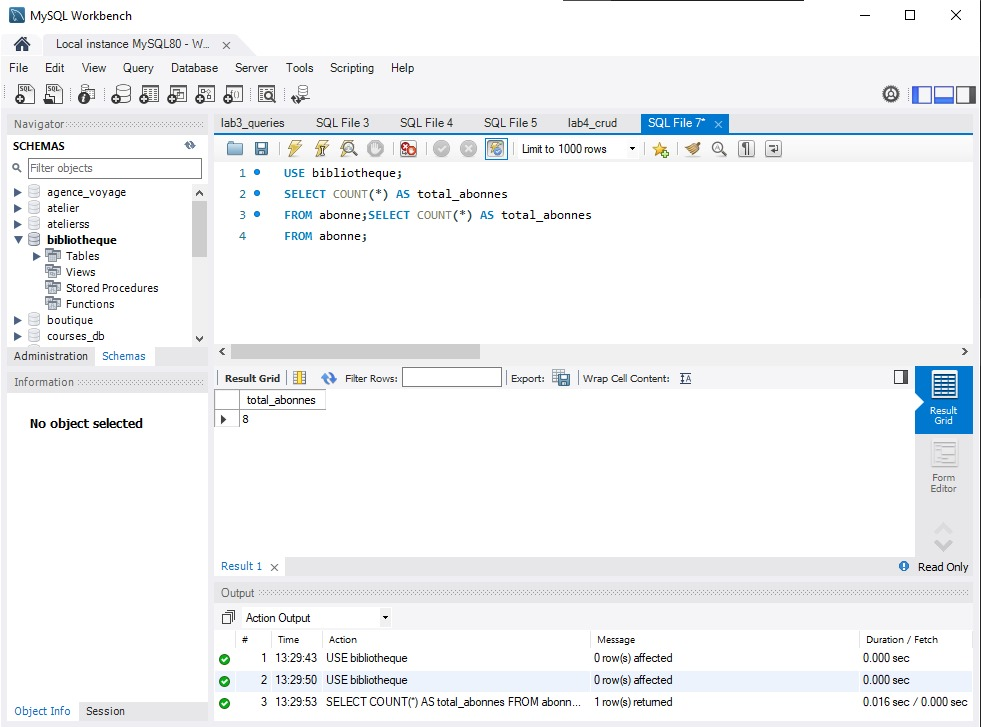 
<em>Figure 1</em>
 

 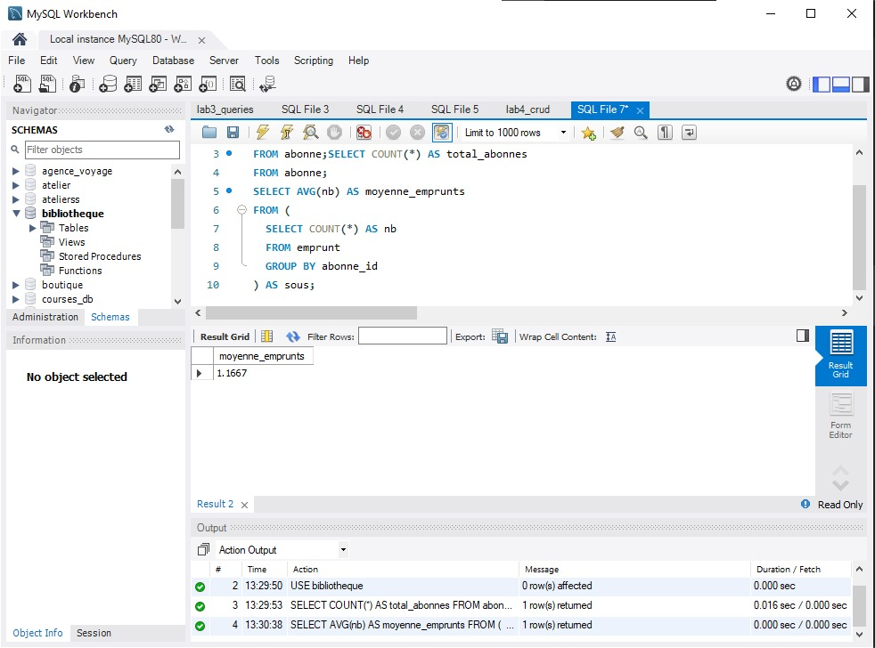 
<em>Figure 2</em>
 

####  Utilisation de GROUP BY

 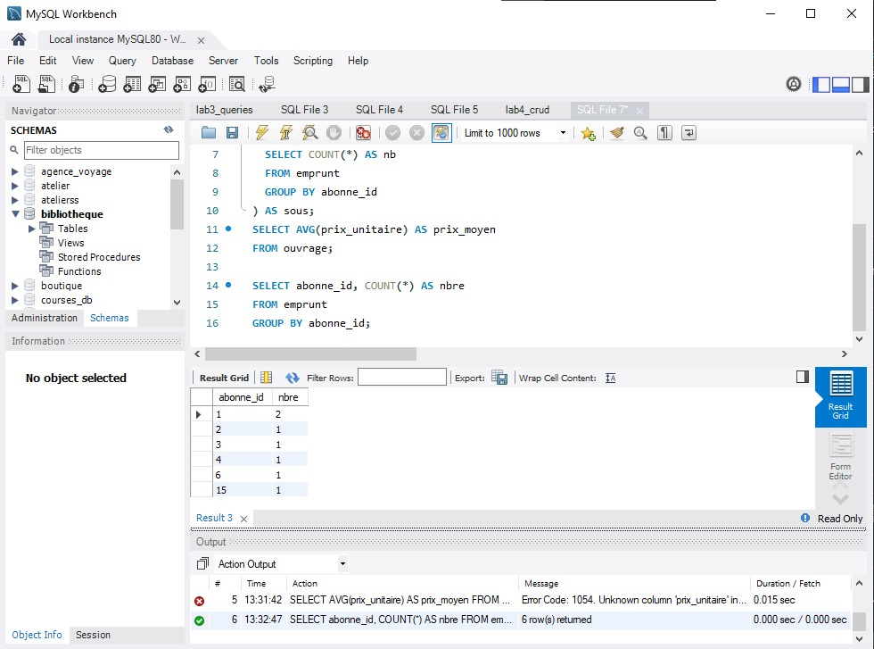 
<em>Figure 3</em>
 

####  Filtrer les groupes avec HAVING

 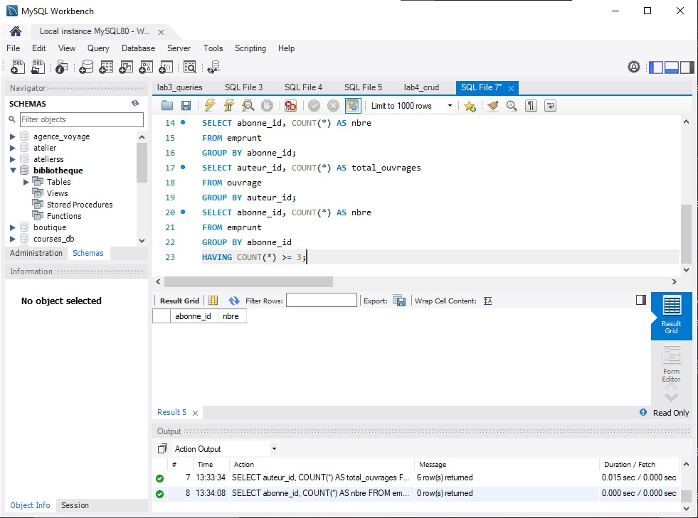 
<em>Figure 4</em>
 

####  Jointures et agrégats combinés

 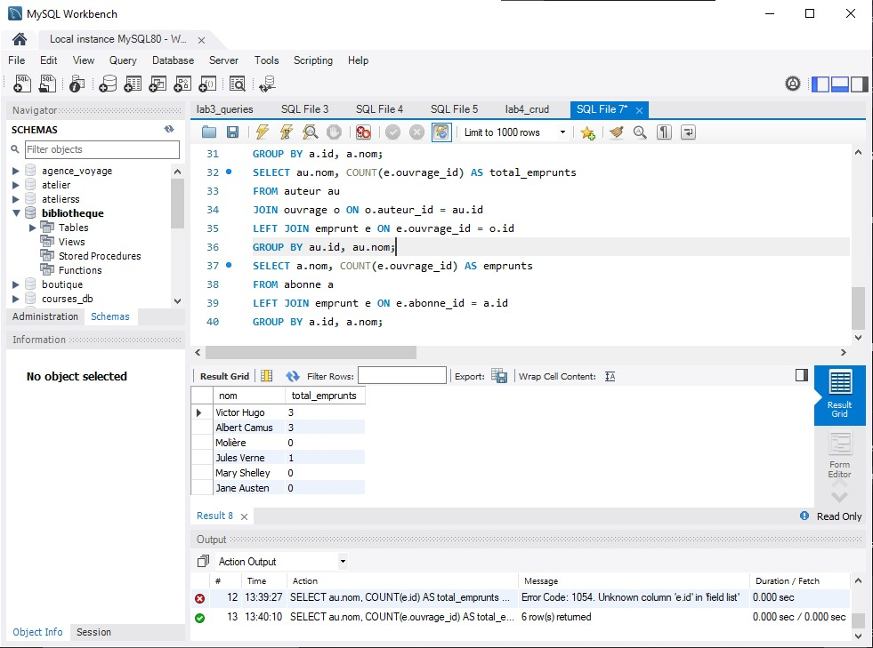 
<em>Figure 5</em>
 

#### Analyses plus complexes (ratio, pourcentage)

 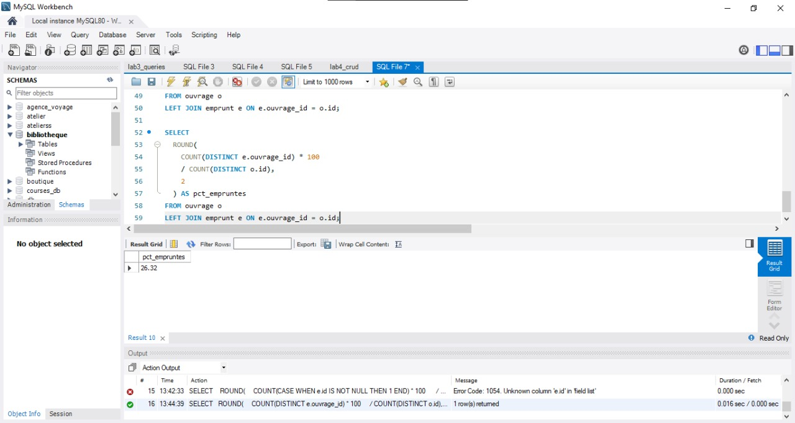 
<em>Figure 6</em>
 

####  Sous-requêtes et CTE pour l’agrégation

 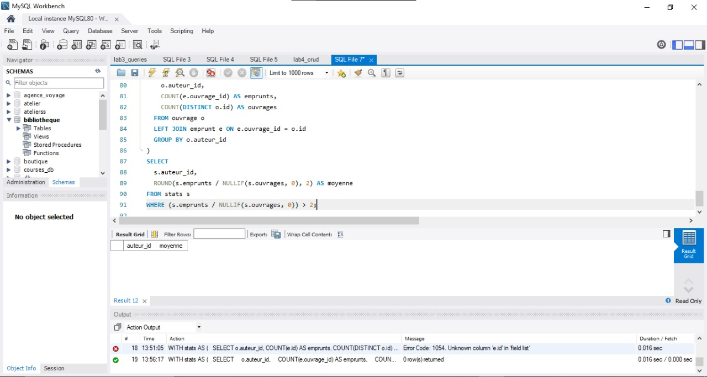 
<em>Figure 7</em>
 

### Exercices pratiques

#### Trouver le nombre moyen d’emprunts par jour de la semaine (utiliser DAYOFWEEK(date_debut)).

 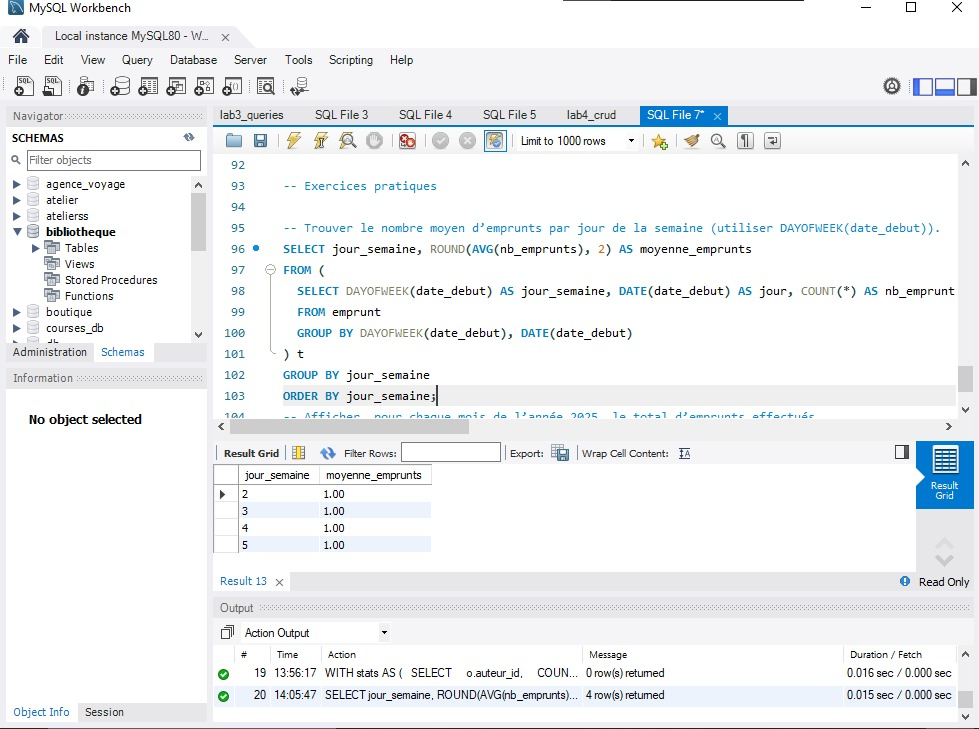 
<em>Figure 8</em>
 

#### Afficher, pour chaque mois de l’année 2025, le total d’emprunts effectués.

 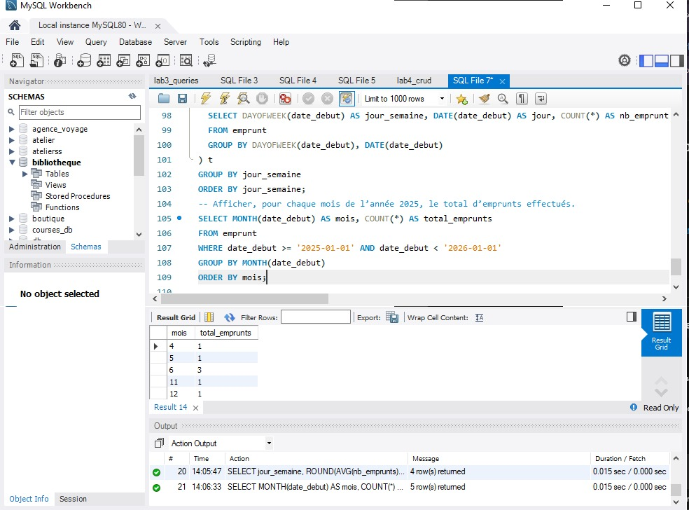 
<em>Figure 9</em>
 

#### Repérer les ouvrages jamais empruntés et compter leur nombre.

 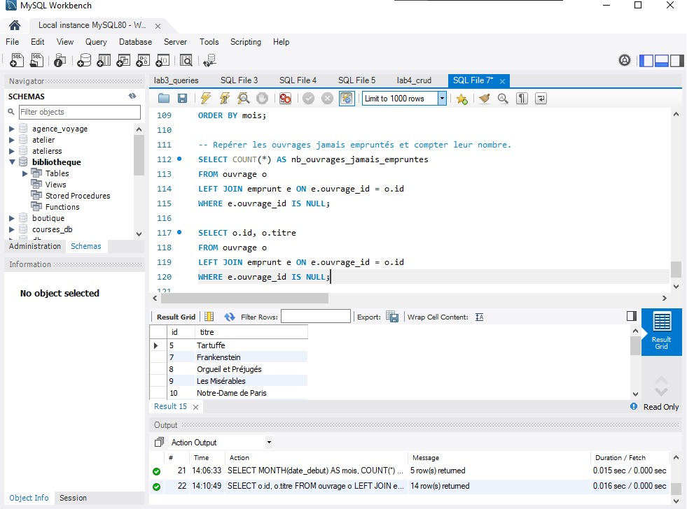 
<em>Figure 10</em>
 

#### Expliquant l’intérêt de chaque type d’agrégation pour le reporting en bref

Les fonctions d’agrégation permettent de synthétiser de grands volumes de données en indicateurs lisibles et exploitables.
Les fonctions comme COUNT et AVG servent à mesurer l’activité (nombre d’emprunts, moyenne par période ou par abonné).
La clause GROUP BY aide à analyser les indicateurs par catégorie, comme le jour, le mois, l’abonné ou l’auteur. La clause HAVING garde seulement les groupes qui comptent vraiment.
Les jointures et les agrégations donnent une vue d’ensemble sur l’activité de la bibliothèque. Les jointures et les agrégations permettent de suivre les performances et d’aider à prendre des décisions.

## La partie exercice

### Résultat visuel 

 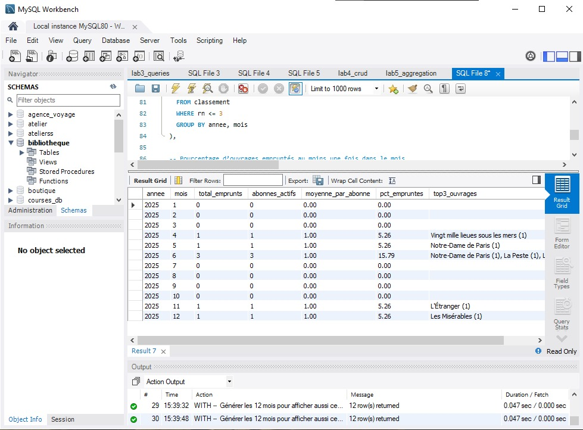 
<em>Figure 11</em>
 

